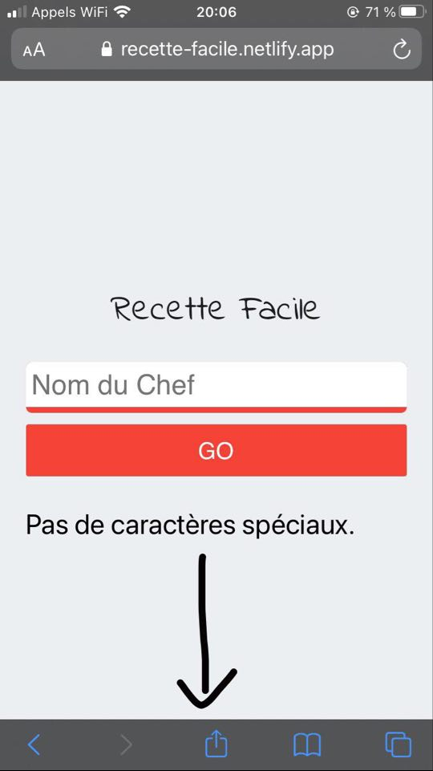
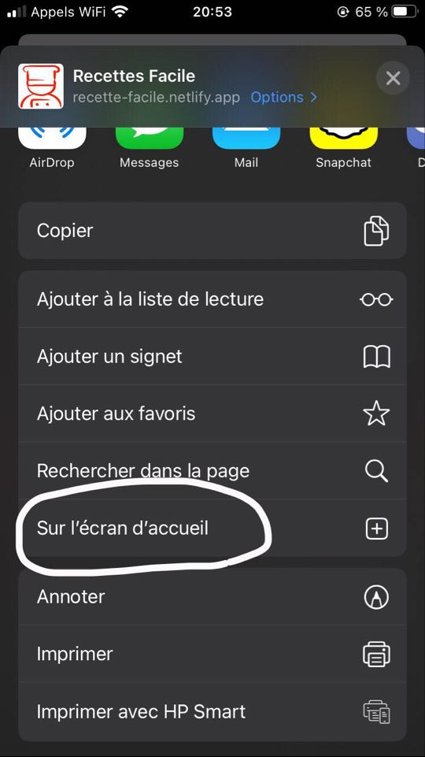
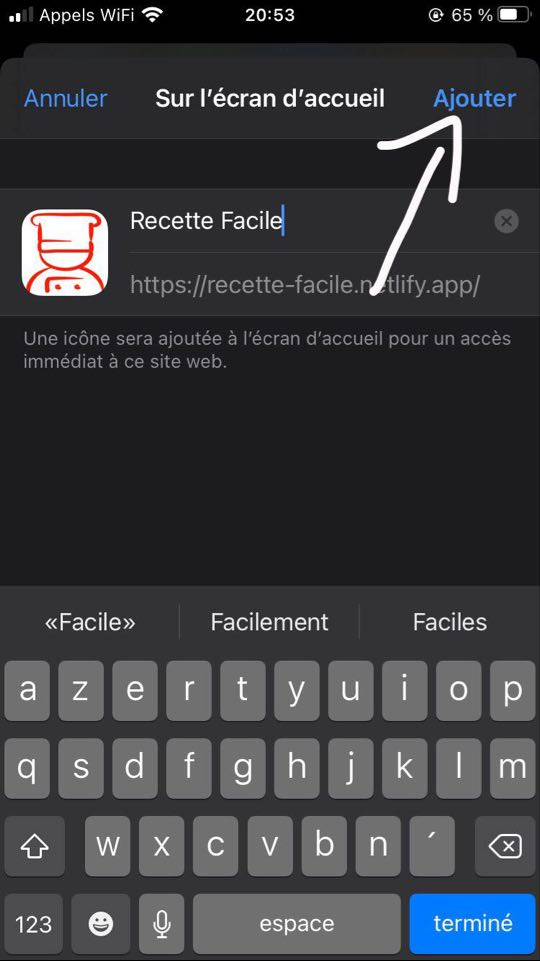

# Cooksy
<div align="center">


</div>
<div align="center">
<a href="https://badge.fury.io/js/react"></a>
</div>

## Requirements

* Node.js 
* Npm
* Good base in React


## Installation

OS X & Linux:

```sh
git clone https://github.com/tutur0001/Cooksy.git
cd Cooksy
npm install 
```
IOS: 
* Go on :
https://cooksy.netlify.app/



* Click on the icon



 * Click on "Sur l'écran d'accueil" 
 


* After this click on "Ajouter" 
well it's ready, Enjoy :)
 

## Start development setup

To start your local serveur do:

```sh
npm start
```

## Add Recipes
To add recipes in seeder go in:
```sh
cd src
vim recettes.js 
```
Follow this template for writing your recipe:

  recette1: {
nom: 'Salade d\'épinards du Soleil',
image: 'epinard.jpg',
ingredients: '450g d\'Épinards, 2 Pommes, 6 tranches de Bacon, 1 Oignon',
instructions: "Laver et couper en 2 les feuilles d'épinards.\nPréparer une sauce vinaigrette.\nLaver et couper les pommes. Emincer l'oignon. Faire griller le Bacon.\nAjouter le tout aux épinards.\nS'accorde bien avec un Pinot Blanc."
},
Follow the indentation format


## Release History

* 1.0
    * First stable version of the project


## Meta

Michon Arthur – michon-arthurpro@protonmail.ch

Distributed under the MIT license. See ``LICENSE`` for more information.

[https://github.com/tutur0001](https://github.com/dbader/)

## Contributing

1. Fork it (<https://github.com/tutur0001/Cooksy.git/fork>)
2. Create your feature branch (`git checkout -b feature/fooBar`)
3. Commit your changes (`git commit -am 'Add some fooBar'`)
4. Push to the branch (`git push origin feature/fooBar`)
5. Create a new Pull Request
6. if you want an access of the db contact me with this mail address michon-arthurpro@protonmail.ch

<!--stackedit_data:
eyJoaXN0b3J5IjpbLTIwNzQyMzE4OTYsLTE1Nzk0MjcyNjcsLT
IxNTk4OTc3Miw3NzcwOTg4OTQsNzI2OTEwNjMyLDE1ODAzNjU4
OTgsMzYwMDk5Mjg3LC0xNjM2MDgzODUwLDExNTEyNTEzNjcsMj
IyNDE1MzIxLDMxNTAxODYyMCwtNTU4NDAzMzY4LC00MzMyNzY1
OTQsMzQzMjEwODIwLC03MzgyNTY0NDgsLTEwMjEzMjEzNDEsMT
UzNjcyNzk0MCwxMjQ3NjA2MjYyLC0yMDg4NzQ2NjEyLC0zMzI0
NTUzNjNdfQ==
-->
